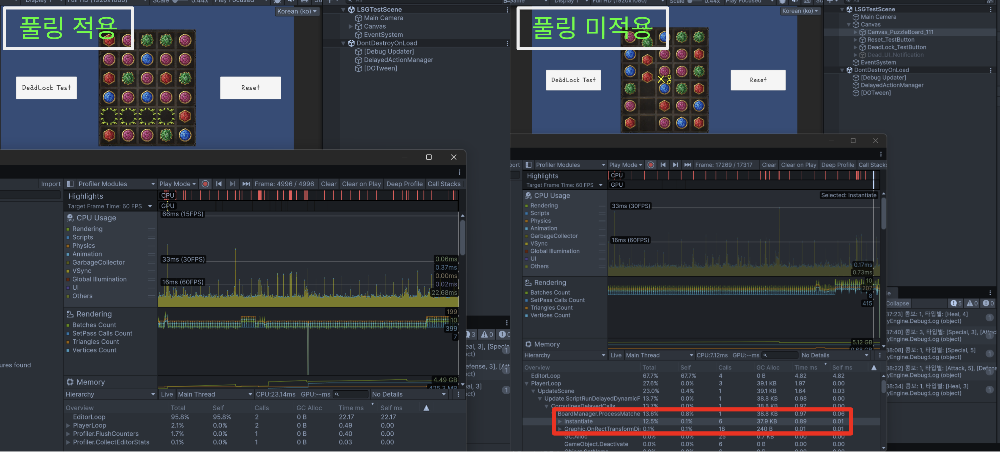
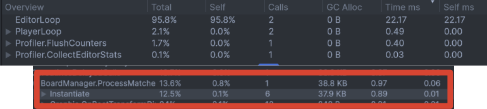

# TEMFKing_기술 문서_이성규

## 프로젝트 소개
- **게임 제목** : 스러진 왕의 영원한 행진 (The Eternal March of the Fallen King)
- **한줄 소개** : 매치3 퍼즐과 턴제 전투를 결합한 로그라이크 게임
- **장르**: 3매치 기반 턴제 전략 로그라이크
- **플랫폼** : PC (Unity)
- **개발기간** : 2026.03.20 ~ 2026.04.09 (3주)
- 팀 정보 : 13인 (기획 8, 프로그래밍 5)

**[시연 영상 및 결과물]**  

- **출시 사이트**: [itch.io 페이지](https://itch.io/jam/drsmart04collab/rate/4443739)
- **Github**: [팀 레포지토리](https://github.com/Kyungil-smart/08-firstcollabproject-Largegini) / [개인 포크](https://github.com/dev-LS-archive/08-firstcollabproject-PuzzleEOF)

## 기술 스택
- Unity 6.3 LTS
- C#
- DOTween — 스왑·낙하·콤보 UI 연출
- Unity Mathematics (int2) — 그리드 좌표 연산용 
- ScriptableObject — 블록 데이터, 튜토리얼 프리셋 데이터 분리
- Addressables — AudioMixer 동적 로드
- Git / Github

## 담당 기능
- 퍼즐 코어 시스템 전반
  - 매치3 퍼즐 코어 시스템 전체 (스왑 → 매칭 → 제거 → 낙하 → 리필 → 연쇄 루프)
  - 12×5 보드 시스템 (버퍼 6행 + 플레이 6행, RectMask2D 마스킹)
  - 블록 드래그 앤 드롭 입력 (UI 좌표 ↔ 그리드 인덱스 역변환, 셀 하이라이트)
  - 블록 재활용 구조 (60개 고정, 파괴 없는 맞춤형 풀링)
  - 초기 3매치 방지 / 데드락 판정
  - 연쇄 결과 출력 (PuzzleResult → UnityEvent → 전투 시스템)
- 퍼즐 확장 기능 및 연출
  - 튜토리얼 훅 인터페이스 설계 (ITutorialBoardControl) 및 핸드오프
  - 콤보 UI 연출 (DOTween Sequence) + 퍼즐 SFX

- AudioMixer 볼륨 제어 방식 건의 및 구현 (MixerVolumeController + VolumeSlider)
- 팀원 코드 통합 시 크로스 파트 이슈 다수 해결

## 구현 내용

### 블록 재활용 기반 연쇄 루프

#### 구현 목적
플레이어가 블록을 스왑하면 매치 판정 → 제거 → 낙하 → 리필 → 재매칭이 매치가 없을 때 까지 자동 반복되는 연쇄루프가 필요했습니다. 연쇄 도중 성능 저하 없이 안정적으로 동작할 필요가 있었습니다.

#### 구현 방법
보드를 12행×5열(버퍼 6행 + 플레이 6행) 총 60칸으로 구성했습니다. UI 캔버스 기반으로 구현하여 버퍼 영역은 RectMask2D로 마스킹하여 블록이 화면 밖에서 자연스럽게 내려오는 연출을 만들었습니다.

블록 60개는 게임 시작 시 한번만 생성(Instantiate)합니다. 매칭된 블록은 이펙트 재생 후 비활성화하여 임시 리사이클 리스트에 보관하고, 리필 시 리스트에서 꺼내 새 타입을 부여한 뒤 버퍼 상단에 재배치합니다. 게임 내내 Destroy는 호출되지 않아 GC의 발생을 원천 차단했습니다.

연쇄 루프는 BoardProcessor에서 코루틴으로 관리하며, 매 사이클마다 콤보 카운트와 타입별 매칭된 블록 수를 누적합니다. 루프 종료 시 PuzzleResult를 UnityEvent로 전투 시스템에 전달합니다.

**[퍼즐 연쇄 흐름 플로우 차트]**  

#### 설계 의도
보드의 사이즈가 6행 5열로 고정이고 플레이 영역 30개 버퍼 영역 30개로 게임상 데이터로 존재할 블록의 갯수는 60개로 항상 고정이다. 블록이 60개 고정인 소규모 보드이므로 범용 Queue/Stack 기반 오브젝트 풀링은 오버 엔지니어링이라 판단했습니다. 하지만 소규모라 해도 매칭할때마다 Destroy/Instantiate를 반복하면 연쇄 중 GC 스파이크와 GC가 발생하는 과정에서 발생하는 급격한 성능저하의 가능성이 있습니다. 따라서 리스트 기반의 간단한 임시 저장 풀링 방식을 택했습니다.

#### 결과
게임 내내 블록 오브젝트가 한 번도 파괴·재생성되지 않아 GC Alloc 발생을 원천 차단했습니다. clearDelay(매칭 및 클리어 시간) 0.05 / dropDurationPerCell(그리드 간당 낙하 소모 시간)  0.01등  극한 설정에서도 상태 오염 없이 정상 완료되는 것을 확인했습니다.

이와 같이 GC가 발생하지 않는 모습을 퍼즐만 동작하는 씬에서 확인 가능합니다.
 
처음에 풀링을 기본으로 잡고 구현하여 테스트를 위해 매칭시 블록을 즉시 파괴 시키고 리필시 새로 생성시켜주는 코드를 작성해 연결후 프로파일러로 테스트시 리필로 인한 Instantiate로 37.9kb의 GC가 생성되는 것을 확인했습니다. 기존의 풀링 방식에선 발생하지 않았을 성능 이슈로 게임 플레이에 영향을 크게 미칠 정도는 아니지만 환경에 따라 플레이 경험에 악영향을 끼칠 수도 있는 이슈를 사전에 방지한 결과입니다.

#### 회고

비동기 처리에서 코루틴, WaitUntil, 콜백 카운터가 혼합되어 있어 흐름 추적이 어렵습니다. UniTask async/await로 통일하면 `이펙트 완료`와 `최소 대기 시간` 두 조건을 동시에 걸고 둘 다 끝나면 진행하는 식으로 한 줄에 표현할 수 있고, `코루틴 → 콜백 → 코루틴`의 복잡한 혼합이 사라지고 시작적으로 한눈에 흐름을 파악 가능합니다.
 
또한 리필이 순수 랜덤이라 이론상 무한 연쇄 가능성이 있습니다. 리필 시점에 매치 유발 타입 필터링과 최대 연쇄 횟수 제한을 안전장치로 추가해야 합니다.

---

### 이펙트 타이밍 충돌 설계 (고스트 블록 버그 방지)

#### 구현 목적

#### 구현 방법

#### 설계 의도

#### 결과

#### 회고

---

### 인터페이스 기반 아키텍처 분리

#### 구현 목적

#### 구현 방법

#### 설계 의도

#### 결과

#### 회고
