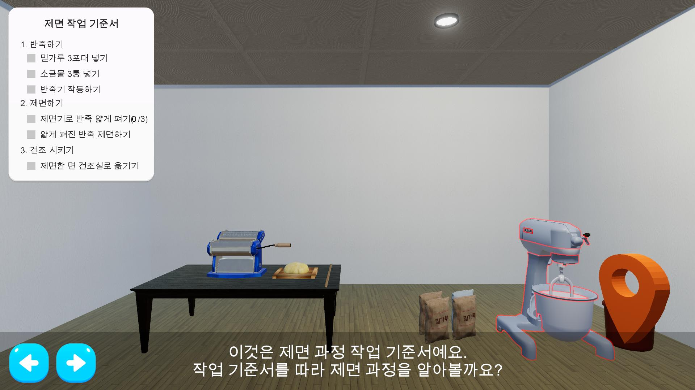
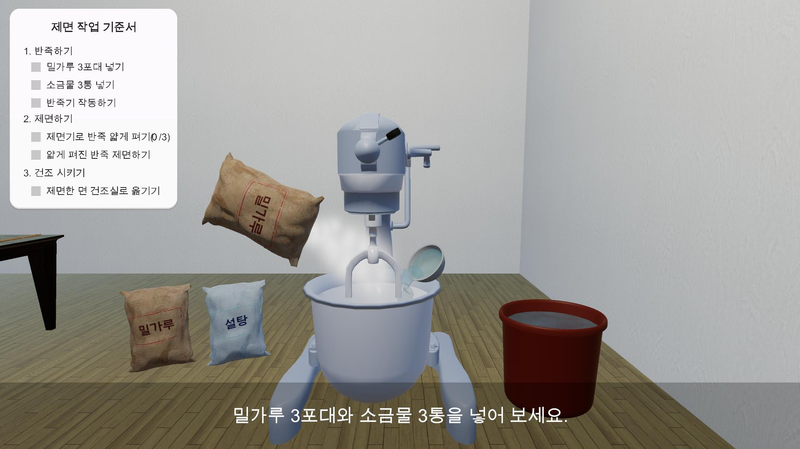
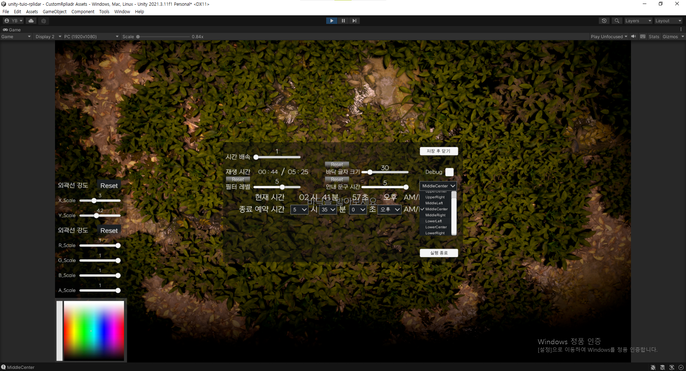
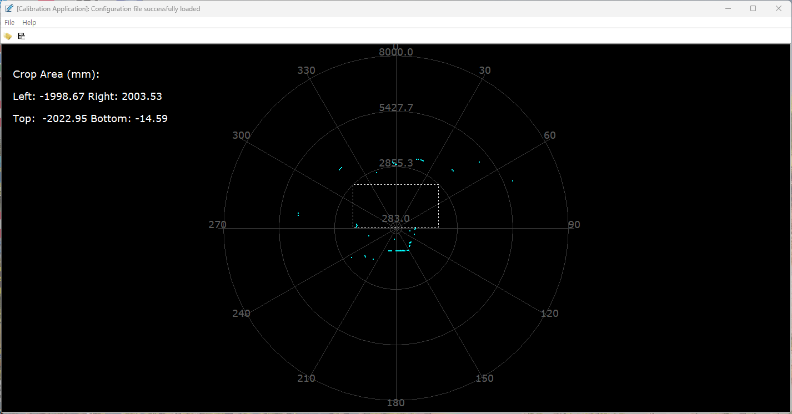
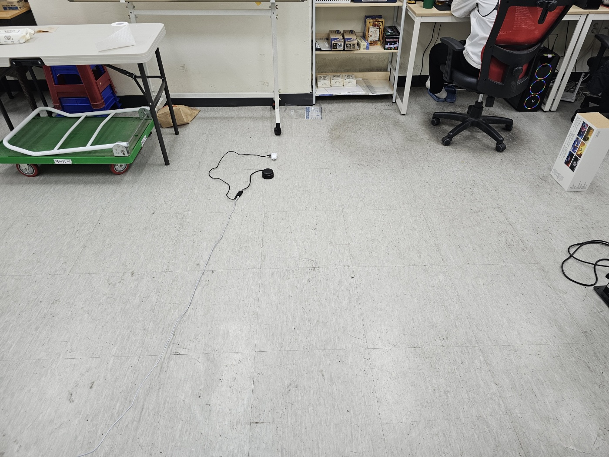
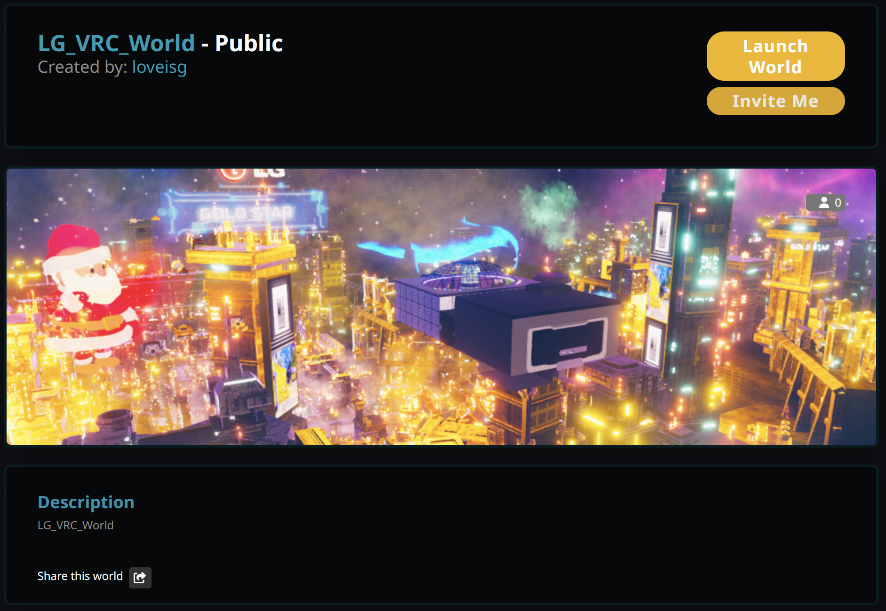

# 이성규 이력서

**Unity 클라이언트 개발자**

## Contact
- **이메일:** gyu3941@gmail.com
- **전화:** 010-xxxx-xxxx
- **GitHub:** [github.com/dev-LS-archive](https://github.com/dev-LS-archive)
- **Blog:** [Velog_lstDev](https://velog.io/@lst9945/posts)
- **거주지**: 충남 천안시

---

## 개요
- 3년 이상의 실무 경험을 보유한 **Unity 클라이언트 프로그래머**입니다.
- **Unity 6**의 **GPU Resident Drawer** 등 최신 렌더링 기술을 연구하고 최적화에 적용하는 등 최신 기능에 관심이 많은 강점이 있습니다.
- 비주얼 구현과 성능의 균형을 중시하며, 아티스트와 원활한 기술적 **커뮤니케이션**이 가능합니다.

---

## 기술 스택

### Engine & Core Programming
- **Unity** — **3년 이상 실무** 및 부트캠프 프로젝트 경험. VR/AR/모바일/PC 등 다양한 플랫폼 최적화 및 빌드 경험
- **C#** — **객체지향 설계 및 최적화**: 인터페이스 기반 의존성 분리, 오브젝트 풀링, SO 이벤트 채널, 델리게이트·이벤트 설계
- **Workflow** — **Git-flow** 브랜치 전략 기반 협업, PR 코드 리뷰 및 머지 충돌 해결 경험.

### Rendering & Graphics Optimization
- Rendering Pipeline — URP/SRP 환경에서의 기술적 대응. SRP Batcher, 라이트 베이킹, APV(Adaptive Probe Volumes) 적용 및 Linear/Gamma 색공간을 포함한 렌더링 파이프라인의 이해.
- **최적화**: 오클루전 컬링, 배칭/인스턴싱, 메쉬 병합을 통한 **드로우콜 및 최적화**

### VR & Extra
- **VR** — XR Interaction Toolkit, SteamVR, HurricaneVR 활용 개발 경험 및 능력 보유.
- **기타** — LiDAR 센서 연동, 유니티를 활용한 영상 제작 참여 경험

---

## 학력
 
### 호서대학교 — 게임 애니메이션 융합학부
 
- 기간: 2017.02 – 2021.02 | 졸업
- 학점: 3.2 / 4.5

## 교육 이력

### XR 기술을 활용한 게임 개발자 부트캠프 — 주식회사디벨로켓에듀
- 기간: 2025.12 – 2026.07 (이수 중)
- 내용: C# 프로그래밍 및 Unity를 활용한 게임 개발, 팀 프로젝트 게임 제작 및 취업 가이드

### AR/VR 기반 기술 및 콘텐츠 제작 스페셜리스트 양성 과정 — 백석대학교

- **현장 실습(취업 연계)**
  - 학습 기관: 레이징덕(취업 연계 기업)
  - 학습 기간: 2020년 9월 ~ 2020년 10월
  - 학습 내용: 기업내 업무 환경 이해 및 해당 개발에 관련된 내용 학습
- **AR/VR 기반 기술 및 콘텐츠 제작 스페셜리스트 양성 과정**
  - 학습 기관: 백석대학교
  - 학습 기간: 2020년 7월 ~ 2020년 9월
  - 학습 내용: 유니티 핵심기능 실습, AR/VR 개발 교육 기업 파견 실무 연계 커리큘럼 교육_기업내부 멘토링

---

## 경력사항

### **레이징덕**
- 직급: 콘텐츠제작팀 | 사원 (유니티 클라이언트 프로그래머)
- 근무 기간: *2020.11 ~ 2024.03*
- 주요 업무 및 성과
  - VR 교육 시뮬레이션, 모바일 교육 앱, LiDAR 센서 연동 콘텐츠 등 다양한 플랫폼 프로젝트 개발·납품
  - 팀 내 레벨 디자이너가 조립한 맵의 VR 타겟 퍼포먼스 확보를 위한 렌더링 최적화 주도 (라이트 베이킹, 배칭·인스턴싱, 메쉬 병합, Blender Remesh를 통한 폴리곤 최적화)
  - 자체 콘텐츠 유튜브 영상 제작 참여 (유니티 타임라인)
  - 팀원 대상 Unity 기술 공유 및 노하우 전달을 자발적으로 수행, 팀 생산성 향상에 기여

---

## 프로젝트 경력

### 스러진 왕의 영원한 행진 — 매치-3 퍼즐 턴제 로그라이크
 
- 기간: 2026.03 – 2026.04 (약 3주)
- 팀 규모: 13인 (기획 8, 프로그래밍 5) (팀원)
- 담당 업무: 클라이언트 프로그래머 — 퍼즐 코어 시스템 전담
- 사용 기술: Unity, C#, 오브젝트 풀링, 인터페이스 설계, DOTween
- 주요 구현:
  - 12행×5열(버퍼 6행 + 플레이 6행) 그리드 매칭→제거→낙하→리필→재매칭 체인 루프 전체 설계·구현
  - 블록 재활용 구조 (60개 고정, 파괴 없는 맞춤형 풀링)
  - 흐름을 제어하는 MonoBehaviour 매니저 스크립트와 역할을 인터페이스로 분리한 순수 C# 클래스로 역할별로 분리해 기능 구현해 결합도를 최소화
  - 튜토리얼 연동을 위해 외부에서 제어가 가능하도록 별도 인터페이스를 설계 + SO 튜토리얼 정보 프리셋 + 테스트 동작 코드 + 가이드 문서 작성
- 링크: [GitHub](https://github.com/Kyungil-smart/08-firstcollabproject-Largegini) / [플레이 영상](https://youtu.be/sxNtjgEBkLA) / [기술 문서](https://github.com/dev-LS-archive/1_portfolio_docs_LSG/blob/main/LSG_%EA%B8%B0%EC%88%A0%EB%AC%B8%EC%84%9C/TEMFKing/TEMFKing_%EA%B8%B0%EC%88%A0%20%EB%AC%B8%EC%84%9C_%EC%9D%B4%EC%84%B1%EA%B7%9C.md)
 
---

### Monotrum — 오디오 리액티브 3D 러너
 
- 기간: 2026.02.26 – 2026.03.06 (9일)
- 팀 규모: 개인 프로젝트
- 담당 업무: 기획·개발·최적화 전체
- 사용 기술: Unity 6 (URP), C#, FFT 오디오 분석, SRP Batcher, GPU Resident Drawer, AudioMixer 스냅샷, 포스트 프로세싱
- 주요 구현:
  - 하나의 속도 비율 값(0.0~1.0)으로 터널 스크롤, 오디오 피치, 카메라 렌즈, 이펙트 강도를 동시에 제어하는 단일 제어점 구조 설계
  - FFT 스펙트럼 데이터를 8밴드로 압축·스무딩하여 터널 링이 음악에 반응하는 리액티브 파이프라인 구현
  - Sin/Cos 원형 배치 + 트레드밀 무한 스크롤로 절차적 터널 생성, 오브젝트 풀링으로 GC Alloc 0 유지
  - Unity 6의 GPU Resident Drawer를 활용한 대량 오브젝트 렌더링 최적화
  - 생성·대기 두 개의 큐로 블록을 관리하는 이중 큐 풀링 시스템 설계
- 링크: [GitHub](https://github.com/dev-LS-archive/Monotrum_unityadvanced-personalproject-dev-LS-archive) / [플레이 영상](https://youtu.be/BigXLCgWW_8?si=VIkDwKj7iw8FTPL_) / [기술 문서](https://github.com/dev-LS-archive/Monotrum_unityadvanced-personalproject-dev-LS-archive/blob/main/Docs/Monotrum_%EA%B8%B0%EC%88%A0%EC%A0%95%EB%A6%AC_%EB%AC%B8%EC%84%9C.md)
 
---
 
### OverTheSky — 3D 플랫포머 액션
 
- 기간: 2026.01.24 – 2026.02.03 (사전 준비 포함 약 10일)
- 팀 규모: 5인 팀(전원 프로그래머) (팀장)
- 담당 업무: 팀 리더 / Core 프레임워크 설계 / 캐릭터 물리 시스템 전담
- 사용 기술: Unity, C#, Rigidbody, SphereCast, Input System, Cinemachine
- 주요 구현:
  - 팀 개발 속도 확보를 위해 프로젝트 시작 전 Core 프레임워크(Singleton, InputManager, Logger)와 PlayerBase를 사전 설계·구현
  - Character Controller 없이 Rigidbody 기반 커스텀 물리 시스템을 직접 설계 (경사면 보정, 입력 버퍼링, 코요테 타임 등)
  - 외부 충격 처리를 ForceReceiver 컴포넌트로 분리하여, 팀원이 AddImpact() 한 줄로 넉백·바람 등 기믹 구현 가능하도록 설계
  - Git 머지 충돌 해결, 코드 리뷰, 팀원 코드 통합 리드
- 링크: [GitHub](https://github.com/Kyungil-smart/05-unitybaiscs-teamproject-dev-LS-archive-1) / [플레이 영상](https://youtu.be/pBfPvFQdeDE?si=aX88XdtFyKwVbNti) / [기술 문서](https://github.com/dev-LS-archive/OverTheSky-Unity_Team_Project/blob/main/Docs/%EB%AC%B8%EC%84%9C%EC%A0%95%EB%A6%AC_%EC%9D%B4%EC%84%B1%EA%B7%9C/OverTheSky_%EC%9C%A0%EB%8B%88%ED%8B%B0%20%ED%8C%80%20%ED%98%91%EC%97%85%20%ED%94%84%EB%A1%9C%EC%A0%9D%ED%8A%B8%20%ED%9A%8C%EA%B3%A0(%EC%9D%B4%EC%84%B1%EA%B7%9C).md)
 
---

### **실무 프로젝트 — 레이징덕 (2020.11 ~ 2024.03)**

#### **직업 체험(3D) 웹 콘텐츠**
- **작업 시기**: 24년도 초반
- **내용**: 직업 재활 시설 견학 교육 프로그램 개발에서 제면 작업 체험 파트 담당
  
  

#### **산업안전 VR 교육 시뮬레이션 다수**
- **작업 시기**: 22년도 후반 ~ 23년도 말
- **내용**: 도로안전, 갱폼, 테트라포트, 터널, 예인선 등 다수의 VR 안전 교육 콘텐츠 개발
- **담당**: 클라이언트 프로그래밍 및 저사양 VR 기기 타겟의 **렌더링 최적화** 주도

- **내용**: 직업 재활 시설 견학 교육 프로그램 개발에서 제면 작업 체험 파트 담당
- 22-24년도 산업안전 VR 교육 시뮬레이션 다수
  도로안전 / 갱폼 / 테트라포트 / 터널 / 예인선 등
  (스크린샷 or 영상 캡처 2~3장)

#### **LiDAR 센서 연동 박물관 인터랙티브 콘텐츠**
- 작업 시기: 22년 중반
- **내용**: 라이다 센서 데이터를 활용한 실시간 체험형 인터랙션 시스템 구축
- **핵심 기술**: Unity, RPLiDAR, TUIO Protocol, TouchScript
- **주요 구현**:
    - 오픈소스(`unity-tuio-rplidar`) 기반의 **라이다-유니티 데이터 파이프라인 구축** 및 커스터마이징
    - **TouchScript** 활용 멀티터치 시스템 구현 및 바닥 상호작용 이펙트 설계
    - [설치 가이드 문서](https://docs.google.com/document/d/1x0AVhfLbcaaZOzPuyBC92ef5ucGiIINl/edit?usp=sharing)
    - [유니티 Rplidar 연결 오픈소스 - GitHub](https://github.com/JpHoooo/unity-tuio-rplidar)
  
  
  

    
  

- VRChat 월드 제작 (LG 프로젝트)
- 
  링크: [LG_VRC_World](https://vrchat.com/home/launch?worldId=wrld_9279b8ef-6bcf-4109-8116-0209d9bebf1c)

- 유튜브 영상 콘텐츠 (Spine 2D / HDRP 3D)
  유니티 타임라인 기반 제작
  (영상 링크 or 캡처)

#### **기타 주요 실무 프로젝트 내역**
- **직업 체험(3D) 웹 콘텐츠**: 제면 공정 등 웹 기반 3D 시뮬레이션 콘텐츠 개발 (2024)
- **VRChat 브랜드 월드 제작**: LG 프로젝트 등 가상 공간 홍보 월드 구축 및 최적화
- **유니티 타임라인 기반 영상 제작**: **Spine 2D / HDRP 3D** 리소스를 활용한 인터랙티브 영상 및 연출 시퀀스 제작
---
 
### 배달지왕 — 모바일 캐주얼 게임 (대학 졸업작품)
 
- 기간: 2020
- 팀 규모: 3인 (기획 2, 프로그래밍 1)
- 담당 업무: 클라이언트 프로그래머
- 사용 기술: Unity, C#
- 주요 구현:
  - 모바일 게임 개발, Google Play Store 출시
- 링크: [플레이 영상](https://youtu.be/yGwlSiNkdEM?si=D7GscB4HOR1lDVo4)

---

## 자기 학습 및 활동

- **VRChat 월드 최적화 가이드 및 글로벌 기술 지원**
    - 해외 제작자 대상 기술 지원을 위해 **일본어 최적화 기술 문서** 직접 작성 및 배포.
    - 드로우콜 절감, 메쉬 결합 등 실무 최적화 노하우 공유를 통한 기술적 문제 해결 기여.ㅈㅈ
    - [기술 문서: VRChat 최적화 가이드 (KR/JP 번역본)](https://docs.google.com/document/d/1yTc725S5BFonoZz-TK4-UdV6-ahUZOopaRzUYqO0PEg/edit?usp=sharing)
- **지속적인 기술 블로그 기록**
    - 부트캠프 학습 과정에서 배운 내용을 작성 및 정리한 TIL을 `벨로그(Velog)`를 통해 꾸준히 공유하여 기록을 남김.

---